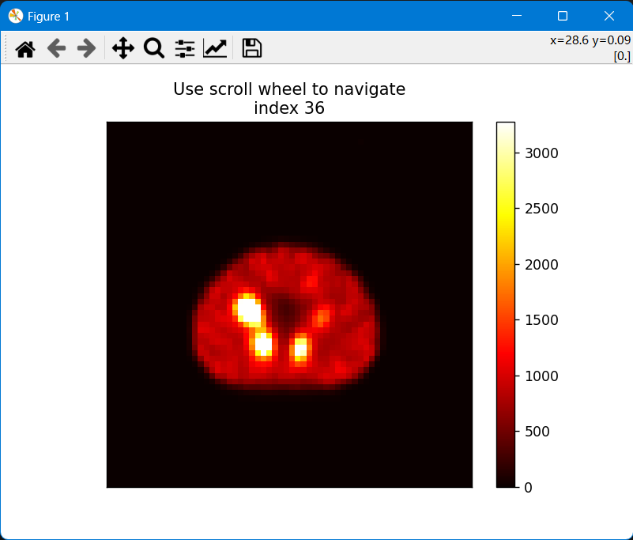

# imvis

Interactive visualization of 3D medical images in python

## Installation

First, clone the repository and install the dependencies:

```bash
git clone xxx
```

Then, build and install the package (in your favorite conda env or venv):

```bash
pip install --upgrade setuptools
pip install --upgrade build

python -m build
pip install --force-reinstall ./dist/imvis-x-x-x-py3-none-any.whl
```

## Features

### 3D image visualization

`imagesc3s` is a function that allows to visualize 3D images in a 2D slice-by-slice fashion. It is based on the `matplotlib` library and allows to interactively scroll through the slices of a 3D image. It also allows to change the color map and the windowing of the image.

```python
import imvis as iv
import pydicom

ds = pydicom.dcmread('path/to/dicom/file')
img = ds.pixel_array
iv.imagesc3s(img)
```



### MIP with rotation angles

`mipz` allows the user to obtain a maximum intensity projection (MIP) of a 3D image along the z-axis. The user can also specify the rotation angles of the MIP.

```python
import SimpleITK as sitk
import numpy as np

img = sitk.ReadImage("/path/to/nifti")
imarray = sitk.GetArrayFromImage(img)
mip_array = np.zeros((36, imarray.shape[0], imarray.shape[1]))
for i in range(0, 360, 10):
    mip_array[int(i/10),:,:] = mipz(imarray, i)
iv.imagesc3s(mip_array, [0, 10])
```
